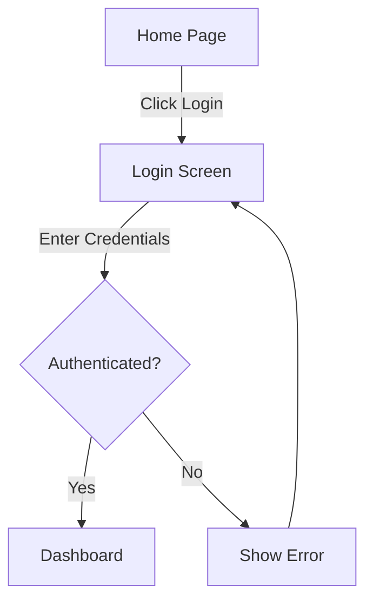

# Generate User Flow Skill

Generate a visual representation of the path a user takes through the system to complete a specific task. This skill maps steps, decision points, and interactions to validate information architecture and user experience.

## Inputs

- `TASK` - The specific user goal or task to map (e.g., "Reset Password", "Purchase Subscription")
- `START_POINT` - The entry point for the user (e.g., "Home Page", "Login Screen")
- `END_POINT` - The success state or final destination (e.g., "Dashboard", "Thank You Page")
- `CONTENT_PATH` - (Optional) The content directory to reference for available pages (e.g., "/docs")
- `HAPPY_PATH_ONLY` - (Optional) Boolean, whether to focus only on the ideal success path (default: false)
- `OUTPUT_FORMAT` - (Optional) Output format: "mermaid", "plantuml", "text-description" (default: "mermaid")

## Workflow

### Step 1: Task Analysis

Analyze the defined `TASK` to understand the user's intent and required steps.
- Identify the primary goal.
- Determine necessary preconditions.

### Step 2: Path Mapping

Map the sequence of interactions from `START_POINT` to `END_POINT`.
- If `CONTENT_PATH` is provided, validate that steps correspond to existing pages or sections.
- Identify intermediate steps (forms, clicks, navigation).

### Step 3: Branch Identification

If `HAPPY_PATH_ONLY` is false, identify potential alternative paths and error states.
- **Decision Points**: "User logged in?", "Form valid?".
- **Error States**: "Invalid password", "Network error".

### Step 4: Flow Generation

Convert the mapped path into the requested `OUTPUT_FORMAT`.

**For Mermaid:**
- Use `graph TD` or `flowchart LR`.
- Represent pages/screens as nodes.
- Represent actions/decisions as edges or rhombuses.

## Required Outputs

A `USER_FLOW_DIAGRAM` in the specified `OUTPUT_FORMAT`.

**Example (Mermaid):**

## Quick Reference

- **Purpose**: Validate navigation logic and identify friction points.
- **Best Practice**: Create separate flows for different personas.
